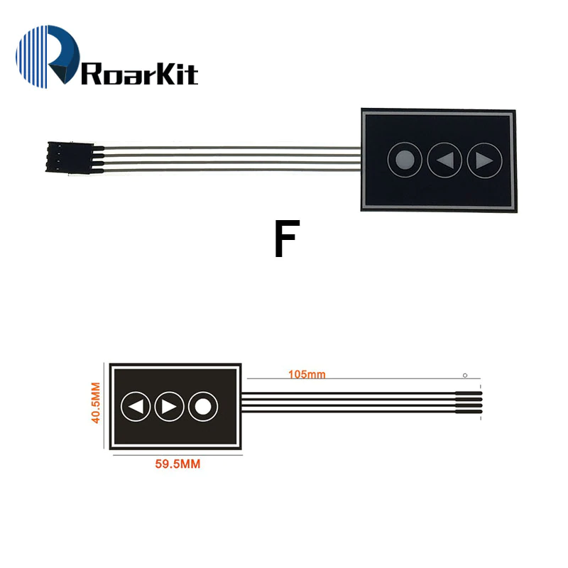

# Chromecastcontrol

A simple ChromeCast remote control for Wemos D1 mini, developed in platformIO. Supports 3 buttons:

- pause/play
- "left"/"right"
  - single click seeks 5s back/forward
  - long press is seeking with increasing speed (seek performed on release)
  - double click selects previous/next item in the playlist

I used the flat membrane switch you can order from aliexpress, like this one:

It also supports a small, 128x64 oled screen, where it prints some information of the song currently playing, connecting to D1/D2 I2C pins

Dependencies:
- [ArduCastControl](https://github.com/andrasbiro/ArduCastControl)
- [WifiManager](https://github.com/tzapu/WiFiManager)
- [U8g2](https://github.com/olikraus/u8g2)
- [OneButton](https://github.com/mathertel/OneButton)